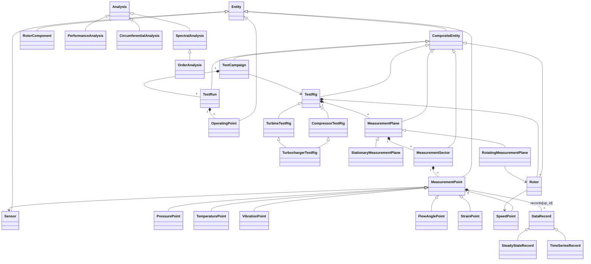

# testrig_postproc – Class Hierarchy

## Package layout

| File | Classes (inheritance) |
|---|---|
| `core/base.py` | `Entity(ABC)`, `CompositeEntity(Entity, Generic[T])` |
| `core/units.py` | `Quantity(Enum)`, `Unit`, `UnitRegistry`, instance `UNITS` |
| `core/geometry.py` | `ReferenceFrame(Enum)`, `Position`, `AngularRange` |
| `core/data.py` | `DataRecord(ABC)` → `SteadyStateRecord`, `TimeSeriesRecord` |
| `core/sensor.py` | `Calibration(ABC)` → `IdentityCalibration`, `PolynomialCalibration`, `LookupTableCalibration`<br>`Sensor(Entity)` → `PressureTransducer` → `DynamicPressureTransducer`; `TemperatureSensor` → `Thermocouple`, `ResistanceThermometer`; `VibrationSensor` → `ProximityProbe`, `Accelerometer`; `StrainGauge`; `SpeedPickup` |
| `core/measurement_point.py` | `MeasurementPoint(Entity, ABC)` → see tree below |
| `core/averaging.py` | `Averager(ABC)` → `ArithmeticAverager`, `AreaWeightedAverager`, `CircumferentialAverager` |
| `core/sector.py` | `MeasurementSector(CompositeEntity[MeasurementPoint])` |
| `core/plane.py` | `PlaneRole(Enum)`, `MeasurementPlane(CompositeEntity[MeasurementSector], ABC)` → `StationaryMeasurementPlane`, `RotatingMeasurementPlane` |
| `core/rotor.py` | `RotorComponent(Entity, ABC)` → `Shaft`, `Disc` → `CompressorWheel`, `TurbineWheel`<br>`Rotor(CompositeEntity[RotorComponent])` |
| `core/test_rig.py` | `TestRig(CompositeEntity[MeasurementPlane])` → `CompressorTestRig`, `TurbineTestRig`, `TurbochargerTestRig(CompressorTestRig, TurbineTestRig)` |
| `core/campaign.py` | `OperatingPoint(Entity)`, `TestRun(CompositeEntity[OperatingPoint])`, `TestCampaign(CompositeEntity[TestRun])` |
| `dataio/readers.py` | `ChannelMap`, `DataReader(ABC)` → `SteadyStateCsvReader`, `TimeSeriesCsvReader`, `Hdf5Reader` (template) |
| `dataio/writers.py` | `ResultWriter(ABC)` → `CsvResultWriter`, `ExcelResultWriter` |
| `processing/steps.py` | `ProcessingStep(ABC)` → `CalibrationStep`, `UnitConversionStep`, `OutlierRemoval`, `TimeAveraging`, `SignalFilter(ABC)` → `MovingAverageFilter`, `LowPassFilter`<br>`ProcessingPipeline` |
| `analysis/base.py` | `AnalysisResult`, `Analysis(ABC)` |
| `analysis/performance.py` | `PerformanceAnalysis(Analysis, ABC)` → `CompressorPerformanceAnalysis`, `TurbinePerformanceAnalysis` |
| `analysis/circumferential.py` | `CircumferentialAnalysis(Analysis)` |
| `analysis/spectral.py` | `SpectralAnalysis(Analysis)` → `OrderAnalysis` |
| `visualization/plotters.py` | `Plotter(ABC)` → `CircumferentialPlotter`, `PerformanceMapPlotter`, `SpectrumPlotter` |

## Composition (has-a) – physical and organisational hierarchy

```
TestCampaign (VA/VB number) ──rig──► TestRig
 └── TestRun                          ├── Rotor ──► RotorComponent (Shaft, CompressorWheel, TurbineWheel)
      └── OperatingPoint (op_id)      │     ├── speed_point: SpeedPoint
                                      │     └── rotating_planes: RotatingMeasurementPlane
                                      └── MeasurementPlane (Stationary | Rotating, PlaneRole)
                                           └── MeasurementSector (AngularRange)
                                                └── MeasurementPoint (Position, Sensor, channel)
                                                     └── records[op_id] ──► DataRecord (SteadyState | TimeSeries)
```

## Measurement point inheritance

```
MeasurementPoint (ABC)
 ├── PressurePoint (ABC)      ├── StaticPressurePoint │ TotalPressurePoint │ DynamicPressurePoint
 ├── TemperaturePoint (ABC)   ├── StaticTemperaturePoint │ TotalTemperaturePoint │ MetalTemperaturePoint
 ├── FlowAnglePoint
 ├── VibrationPoint (ABC)     ├── DisplacementPoint │ AccelerationPoint
 ├── StrainPoint
 └── SpeedPoint
```

## UML class diagram (Mermaid)



## Design patterns used
- **Composite** – `CompositeEntity` for rig → plane → sector → point (uniform `add/get/walk/find`).
- **Strategy** – `Averager` subclasses plug into sector/plane averages and analyses.
- **Pipeline** – `ProcessingPipeline` chains `ProcessingStep`s.
- **Template method** – `Analysis.run()` = `validate()` + `_evaluate()`.
- **Registry** – `UNITS` (unit conversion), `POINT_TYPES` (point class lookup by name, e.g. from config files).

## Extending
- New sensor/point type: subclass the matching abstract class and set `quantity` / `default_unit`.
- New data source: subclass `DataReader` and implement `read()`.
- New evaluation: subclass `Analysis` and implement `_evaluate()` returning `AnalysisResult`.
